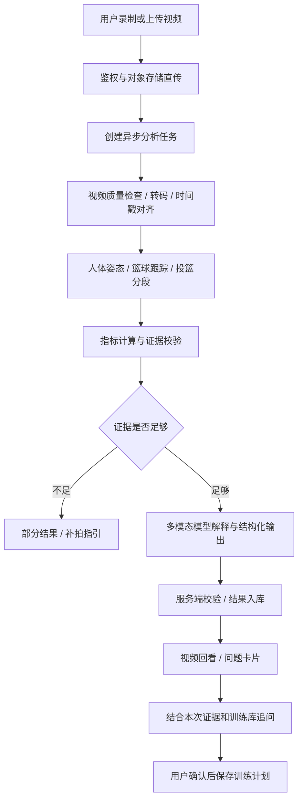

# 球球：预期技术实现方案

更新日期：2026-09-22。状态：**拟议方案，尚未实现后端与真实模型分析**。

当前 GitHub Pages 是可交互的设计 Demo。本文说明如何把“上传投篮视频—查看动作问题—追问—制定训练计划”做成真实产品。涉及的参数、阈值和技术组合是工程建议，需用真实授权样本验证；不构成已达到的准确率或性能承诺。

## 1. 首版做什么

首版聚焦单人、固定机位、全身与篮球可见的短视频，支持用户选择惯用手、场地和点位。建议先限制为 10–60 秒、最多 200 MB 的上传，限制值由试运行调整。多人与严重遮挡的视频提示重拍或手动选择目标。

先交付可回看的证据：识别投篮片段，显示关键姿态、问题时间点、动作一致性和适量训练建议。命中判断、球速和三维动作精测不作为首版默认能力。

## 2. 总体链路



推荐起步组合：前端继续复用当前交互；业务 API 使用 FastAPI；PostgreSQL 保存会话和结果；对象存储保存视频与关键帧；Redis + Celery 管理异步任务；独立 Worker 运行 FFmpeg、姿态模型和模型 API 调用。这是候选架构，不要求首版拆成大量微服务。GPU 推理与普通业务接口分开扩容。

## 3. 视频怎么变成可分析数据

1. 后端签发短期上传凭证，前端把视频直传私有对象存储；完成后由服务端检查真实大小、类型、可解码性与文件校验值。
2. 用 ffprobe 读取分辨率、时长、旋转信息、帧率和时间基；用 FFmpeg 生成统一朝向的分析副本及浏览器播放副本。处理变帧率视频时保留到原视频时间戳的映射，避免标注跳到错误画面。[FFmpeg 官方文档](https://ffmpeg.org/ffmpeg.html)
3. 检查模糊、曝光、全身可见性、目标大小、机位移动和遮挡。失败时输出原因，不能把拍摄质量差当成动作差。
4. 姿态时序以足够密集的帧进行分析，候选起点为 15–30 fps；释放附近优先使用源视频帧。给大模型的解释输入只精选关键帧，不能用稀疏抽帧代替动作检测。
5. 抽取准备、下蹲、抬球、释放候选、随球、落地等阶段；保存帧 ID、毫秒时间戳、主体轨迹和置信度。声音不是首版分析的必要输入，默认不发给模型。

## 4. 哪些模型做哪些工作

| 任务 | 候选实现 | 输出与边界 |
| --- | --- | --- |
| 人体姿态 | MediaPipe Pose Landmarker 作为首版基线 | 33 个关键点及可见性信息；不是篮球技术评分器 |
| 球与篮筐检测 | 针对篮球视频训练或微调的目标检测器，结合时序跟踪 | 球/篮筐位置、目标 ID、轨迹；需要标注数据与独立评测 |
| 投篮事件分段 | 先用姿态时序与球轨迹规则；数据积累后训练时序分类器 | 每次投篮的起止区间、释放候选时刻与事件置信度 |
| 动作指标 | 经过教练复核的计算规则 | 肘角、躯干倾斜、出手相对高度、随球持续时间等代理指标 |
| 解释与追问 | 支持图像输入和结构化输出的多模态模型，通过服务端 API 调用 | 把证据转成可读建议；不得自行发明角度、时间戳和诊断 |
| 训练计划 | 教练审核训练库 + 匹配规则 + 大模型组织语言 | 输出训练条目 ID、目的、组次和调整条件 |

MediaPipe 官方支持图像与视频人体关键点检测，模型跟踪 33 个身体点；其输出不直接提供投篮质量、球轨迹或肌肉发力结论。[官方说明](https://developers.google.com/edge/mediapipe/solutions/vision/pose_landmarker)

单机位二维角度会受透视影响；估计的空间关键点也不能自动当作精确生物力学测量。必须保存机位信息并使用机位对应的规则。普通视频不能直接测量肌肉力量，Demo 中“上肢发力不均”落地时应优先改为可观察的“抬球节奏不同步”等描述，除非额外传感器与验证研究支持原结论。

“稳定性”表示同一用户在可比较机位下，多次有效投篮的动作一致性：先对齐动作阶段，再计算若干可靠指标的离散程度。它不等同于单次动作好坏或命中率。有效投篮数量不足时显示“样本不足”；建议试验起点为至少 5 次，但最终门槛、权重及低/中/高阈值必须经教练标注集校准。单次卡片可以引用整组一致性结果，不能伪装成单次独立评分。

## 5. 大模型 API 怎么接

MVP 候选采用 OpenAI Responses API：`POST https://api.openai.com/v1/responses`。服务端组织 `input_text`（指标、证据索引、机位、用户问题）和 `input_image`（带时间戳说明的关键帧），而不是假定图片接口能够直接接收任意 MP4。图像输入方式按官方文档接入；视频分段与数值计算由前面的视觉服务完成。[图像输入文档](https://developers.openai.com/api/docs/guides/images-vision)

模型 ID 通过服务端配置 `VISION_MODEL` / `CHAT_MODEL` 注入，先确认账号、服务地区与所选模型的图像、结构化输出、流式能力，再在篮球样本集上评测。模型选择依据证据一致性、中文可读性、拒答能力、延迟和单视频成本，而不是直接锁定“最新”型号。若服务地区不适用，替换供应商适配层并重新评测，不能假定所有供应商请求格式兼容。

分析报告使用 `text.format` 的 `json_schema` 与 `strict: true` 约束字段形状。服务端还必须验证时间范围、证据 ID、训练条目 ID 和业务枚举；Schema 合法不代表结论真实。模型拒绝、输出不完整或业务校验失败时进入明确失败/部分成功分支。[Structured Outputs 文档](https://developers.openai.com/api/docs/guides/structured-outputs)

追问使用 `stream: true`，把 `response.output_text.delta` 转成前端增量文本；收到 `response.completed` 且前端文字展示队列消耗完毕后，再等待 500ms 显示推荐追问。错误或中断不触发“回答完成”动画。[流式响应文档](https://developers.openai.com/api/docs/guides/streaming-responses)

每次追问绑定 `analysis_id`、`shot_id` 和 `conversation_id`，只取授权用户的相关证据与审核训练内容。普通追问复用已计算指标，不重复分析整段视频。证据不足时直接解释缺少的拍摄条件。训练计划由用户点击确认后写入数据库，模型生成文本本身不等于已保存。

## 6. 产品自己的 API 契约（拟定）

下表是需要开发的业务接口，不是 OpenAI 或 MediaPipe 现成接口。鉴权默认使用用户会话；API Key 只在后端保管。

| 接口 | 请求重点 | 返回 / 行为 |
| --- | --- | --- |
| `POST /v1/uploads` | 文件名、声明大小、MIME | `upload_id`、短期上传地址与过期时间 |
| `POST /v1/uploads/{id}/complete` | 校验值 | 服务端验收后的 `video_id`；未完成文件不能分析 |
| `POST /v1/analyses` | `video_id`、惯用手、机位、点位；幂等键 | HTTP 202、`analysis_id`、`queued` |
| `GET /v1/analyses/{id}` | 分析 ID | 当前阶段、可用结果、失败码 |
| `GET /v1/analyses/{id}/events` | SSE / 上次事件 ID | 带递增 ID 的进度事件；断线可恢复，轮询兜底 |
| `GET /v1/analyses/{id}/shots` | 分析 ID | 投篮片段、问题证据与短期回看地址 |
| `POST /v1/conversations/{id}/messages` | 问题、`analysis_id`、`shot_id` | 通过 fetch 读取流式回答与完成事件 |
| `POST /v1/training-plans/items` | 经校验的训练 ID、关联问题 ID、幂等键 | 已保存条目；重复点击不产生重复条目 |
| `GET /v1/training-plans` | 当前用户 | 首页训练计划列表 |
| `DELETE /v1/videos/{id}` | 视频 ID | 删除任务状态，同时清理派生帧、骨骼和关联敏感数据 |

任务状态建议：`queued → preprocessing → detecting → evaluating → explaining → completed`，并允许 `partial`、`failed`、`cancelled`。进度来自实际任务阶段和已处理帧数，不用固定计时伪装完成。队列支持重试、超时、取消与幂等，解释服务失败不必重跑全部视觉分析。

## 7. 输出结果长什么样

以下为接口形状示例，数值和内容均为虚构测试数据，不代表真实分析：

```json
{
  "analysis_id": "analysis_demo",
  "status": "completed",
  "versions": {"vision": "candidate-v1", "rules": "draft-v1", "prompt": "draft-v1"},
  "quality": {"usable": true, "camera_view": "side", "warnings": []},
  "consistency": {"label": "insufficient_data", "valid_shots": 1, "scope": "session"},
  "shots": [{
    "shot_id": "shot_1",
    "start_ms": 1200,
    "end_ms": 3800,
    "release_ms": 2400,
    "issues": [{
      "code": "trunk_lean_candidate",
      "title": "出手时身体前倾较明显",
      "evidence_ids": ["frame_2400", "metric_trunk_1"],
      "assessment": "needs_review",
      "explanation": "侧面关键帧显示躯干前倾，建议结合连续片段复核。",
      "drill_ids": ["drill_balance_01"]
    }]
  }]
}
```

前端依据 `start_ms/end_ms` 回放片段，按经过旋转与裁剪映射的坐标绘制骨骼。报告引用不可变版本的指标和证据。缺失的释放时刻允许 `null`；视频里看不见球离手时不能强行生成精确毫秒值。

## 8. 质量、成本和数据管理

- **验证集：** 使用授权视频，按用户划分训练与测试集，覆盖左右手、衣着、光照、机型和不同机位，避免同一人的近重复片段泄漏。请教练标注事件与可观察问题，并记录分歧。
- **验收指标：** 投篮事件精确率/召回率、释放时间误差分布、关键点可靠性、问题误报率、证据引用正确率、低质量输入的正确拒答率。先建立基线，再确定上线门槛，不虚报准确率。
- **稳定性校准：** 分机位与拍摄条件验证，一致性等级需要和专家判断比较；模型口头给出的“置信度 0.9”不是经校准的概率。
- **成本：** 单次成本拆成视频存储、转码/姿态计算时长、关键帧输入与输出 token、重试和传输。首版只发必要关键帧，限制调用次数；缓存按用户、视频哈希与模型版本隔离。记录真实账单后再定价格。
- **性能：** 分别测上传、排队、视觉处理、解释和首 token 的 p50/p95；长任务异步执行。先用真实样本与部署机器压测，不承诺固定几秒出结果。
- **保护数据：** 原视频私有存储，签名地址短期有效；结果和视频按用户校验归属；上传时说明第三方模型处理；日志不记录完整视频或密钥；用户可删除原视频与派生数据。默认不把视频用于训练，二次训练另取明确授权。
- **建议边界：** 不从视频输出伤病诊断或“继续练一定安全”。疼痛相关反馈转成暂停训练、寻求合适专业帮助的产品流程；首版训练量由审核规则约束，而非自由生成。

## 9. 分阶段落地

| 阶段 | 交付 | 通过条件 |
| --- | --- | --- |
| A：数据与规则验证 | 采集规范、授权样本、教练标注、姿态基线 | 明确哪些问题能可靠观察，哪些必须补拍 |
| B：分析 MVP | 上传、分段、证据回看、异步任务与报告 | 在冻结测试集达到团队预设门槛，错误可解释 |
| C：对话与计划 | 证据绑定追问、审核训练库、计划持久化 | 无证据编造受控，计划写入幂等，完整链路可恢复 |
| D：规模化优化 | 成本路由、模型升级回归、监控和灰度 | 新版本不降低关键质量指标，达到实测成本与延迟目标 |

建议先验证“能否可靠定位问题”，再扩展模型与建议范围。当前 Demo 的视觉样式、骨骼示意、解析进度和回答文案，不应被视为模型能力验证结果。
